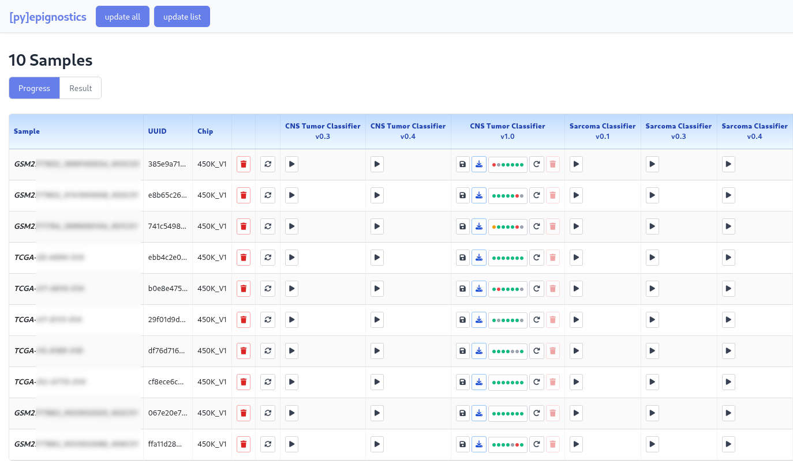
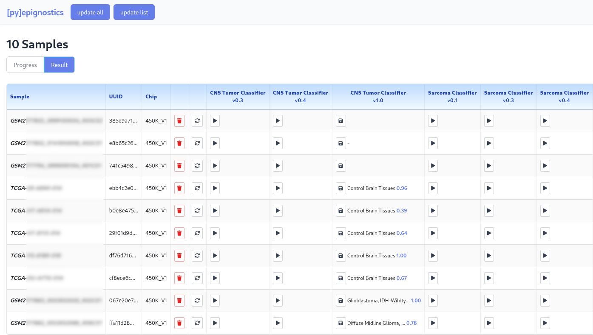

# [py]epignostics

Python client for the Epignostix CNS and Sarcoma methylation analysis platform (https://epignostix.com/).

## What is it?

**[py]epignostics** provides programmatic access to Epignostix (https://epignostix.com/), a web portal for analyzing methylation microarray (IDAT) files. This interface is designed for:

- **List view with progress tracking** - See all samples, their workflow status, and primary classification results at a glance
- **Batch download and organize** - Automatically fetch and organize completed analysis results
- **Restart workflows** - Rerun analyses on samples (not available in web interface)
- **CGC calculation** - Use for computing methylation-based classification scores and tumor methylome profiling
- **Automation** - Integrate Epignostix analysis into Python pipelines and workflows
- **Custom dashboards** - Build analysis workflows tailored to your research needs

The package includes both a Python API and a web interface for interactive sample management.

## Requirements

- Python 3.9+
- Epignostix account with credentials

## Quick Start

```bash
./install.sh
cp config.txt.example config.txt  # Edit with your credentials
./scripts/epignostics-proxy-server.sh
```

Then open your browser to `http://localhost:5000/`

## Screenshots

**Sample overview with workflow status:**



**Detailed sample information and results:**



## Installation

**For development:**
```bash
git clone https://github.com/yhoogstrate/pymnp.git
cd pymnp
./install.sh
```

## Configuration

Create a credentials file:
```bash
cp config.txt.example config.txt
```

Edit `config.txt` with your Epignostix credentials:
```
user=your.email@example.com
pwd=yourpassword
```

## Usage

### Web Interface

Start the web server:
```bash
./scripts/epignostics-proxy-server.sh
```

Open `http://localhost:5000/` in your browser to:
- **List view** - See all samples with workflow status and primary results (classification, CGC)
- **Execute workflows** - Submit analysis jobs on samples
- **Restart workflows** - Rerun analyses (unique feature not in standard Epignostix interface)
- **Monitor progress** - Track workflow execution status and completion
- **Download results** - Fetch analysis outputs (JSON, plots, reports)

### Python API

```python
from pyepignostics.epignostics import EpignosticsPortalClient

# Initialize client
app = EpignosticsPortalClient()
app.login()

# Get all samples
samples = app.get_samples()
for sample in samples:
    print(f"{sample._name}: {len(sample._workflow_runs)} runs")

# Get available workflows
workflows = app.get_workflows()
for workflow in workflows:
    print(f"{workflow.name_short} (v{workflow.version})")

# Execute a workflow on a sample
sample_id = samples[0]._id
workflow_id = workflows[0].id
app.execute_workflow(sample_id, workflow_id)
```

### Batch Downloader

Download and organize completed analysis results to `./cache/`:

```bash
./scripts/download-results.sh              # Download all samples
./scripts/download-results.sh TCGA-S9      # Download only samples matching "TCGA-S9"
```

**First run** - Download all completed results:
```
INFO:__main__:Found 34 samples
Samples: 34%|████ | 12/34 [02:15<04:30, 8.2s/it]
INFO:__main__:Downloading: TCGA-S9-A6WI-01A / epxCNS_v1_0_0 (run 42)
Downloaded: 12 | Already cached: 0 | Filtered out: 0
```

**Second run** - Skip already-cached results:
```
INFO:__main__:Found 34 samples
Samples: 100%|████████| 34/34 [00:45<00:00, 1.3s/it]
Downloaded: 0 | Already cached: 12 | Filtered out: 0
```

**Filtered run** - Download only matching samples:
```
INFO:__main__:Found 34 samples (filter: 'TCGA-S9')
Samples: 100%|████████| 34/34 [00:12<00:00, 2.8s/it]
Downloaded: 2 | Already cached: 1 | Filtered out: 32
```

Results are organized in subdirectories by workflow and sample:

```
cache/
  epxCNS_v1_0_0_classifier__v1_0_0__15/
    TCGA-S9-A6WI-01A_42/
      epxCNS_v1_0_0_sex/
        epxCNS_v1_0_0_sex_sex.json
      epxCNS_v1_0_0_classifier/
        epxCNS_v1_0_0_classifier_classifier.json
        epxCNS_v1_0_0_classifier_classifier_summary.json
      epxCNS_v1_0_0_report/
        epxCNS_v1_0_0_report_report_pdf.pdf
```

**Downloaded files include:**
- CNS classifier results (tumor classification)
- CGC scores (methylation-based classification)
- Sex determination
- MGMT methylation status
- QC metrics and plots
- Full analysis reports

## Testing

Run the test suite:
```bash
./test.sh
```

Tests include:
- API authentication and token refresh
- Sample and workflow management
- 401 error handling and automatic re-login
- Workflow execution and status tracking

## Project Structure

```
pyepignostics/              # Main package
├── epignostics.py          # API client (EpignosticsPortalClient)
├── workflows.py            # Workflow and WorkflowRegistry
└── __init__.py

doc/
└── API_REFERENCE.md        # Complete Epignostix API documentation

scripts/
├── epignostics-proxy-server.sh  # Start web server
└── download-results.sh          # Batch download analysis results

tests/                       # Pytest test suite
├── test_login.py
├── test_401_handling.py
└── test_workflows.py

bin/                         # Utility scripts
├── download-results.py          # Batch result downloader
└── ...
```

## Documentation

- **API Reference**: See `./doc/API_REFERENCE.md` for complete endpoint documentation
- **Token Handling**: The client automatically handles token expiration (401 errors) by re-authenticating
- **Workflow Runs**: Use the API to query workflow execution status and retrieve task results

## Architecture

The application consists of:

1. **EpignosticsPortalClient** - Core API client with automatic session management
2. **Workflow/WorkflowRegistry** - Workflow metadata and registry
3. **Sample/workflow_run classes** - Data models for samples and execution runs
4. **Web Interface** - Flask-based UI for interactive use
5. **CLI Tools** - Batch processing utilities

All HTTP requests include automatic token refresh on 401 errors, ensuring seamless operation even when sessions expire.
